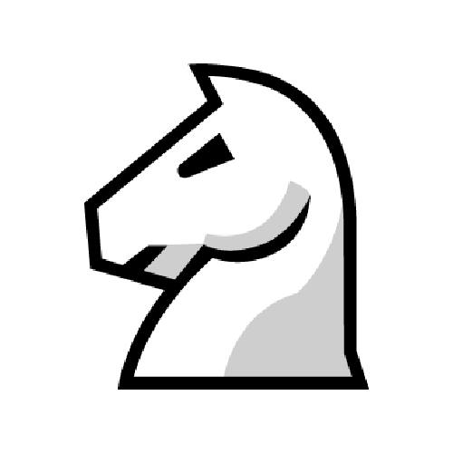
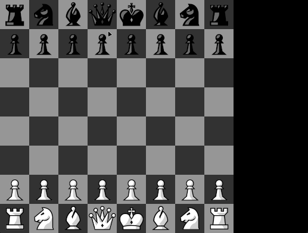
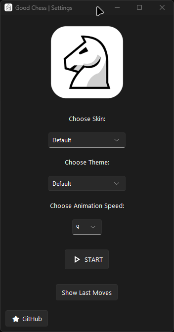

<div align="center">
    
</div>

<h1 align="center">
    GoodChess
</h1>

<div align="center">
    <h3 align="center">A powerful chess game implemented in Python</h3>

   <p align="center">
     <a href="#overview">Overview</a> •
     <a href="#features">Features</a> •
     <a href="#how-to-play">How to Play</a> •
     <a href="#controls">Controls</a>
   </p>

   
   
</div>

<div align="center">
   <p>
      Welcome to GoodChess! This is a powerful chess game implemented in Python, providing a user-friendly interface and a range of features for an enjoyable gaming experience.
   </p>
</div>

## Overview

GoodChess is a simple yet powerful chess game created in Python. It supports standard chess rules, offering an engaging
and strategic gameplay experience.

## Features:

- **Graphical User Interface:** Enjoy playing chess in a visually appealing environment.
- **Move Log:** Keep track of all moves made during the game with a move log displayed on the right side of the
  chessboard.
- **Move Highlighting:** Highlight all possible moves for a selected piece.
- **Themes:** Choose between board themes and piece themes to customize your gaming experience.
- **Practice Mode:** Practise your chess skills by playing against the computer.
- **Undo Move:** Made a mistake? No worries! You can undo your last move and try a different strategy when playing using
  practice mode.
- **Restart Game:** Want to start over? You can restart the game at any time by pressing the R key.
- **Checkmate and Stalemate:** The game ends when a player is in checkmate or stalemate.

## How to Play:

### Precompiled Executable:

1. Download the latest release from [here](https://github.com/t0ry003/GoodChess/releases/latest).
2. Unzip the downloaded file.
3. Run the executable file.

### From Source:

1. Ensure you have Python installed on your machine;
2. Clone this repository and navigate to the Chess directory;
3. Install the required libraries by running the following command in the terminal:
   ```bash
   pip install -r requirements.txt
    ```
4. Run the following command to start the game:
   ```bash
   python ChessMain.py
   ```
5. Enjoy!

## Controls:

- **Mouse Click:** Select and move pieces by clicking on the source and destination squares.

#### Only in practice mode:

- `Z Key` Undo the last move.
- `R Key` Restart the game.

## 📄 [Documentation](/DOCUMENTATION.md)

If you want to know more about the script, you can read the documentation [here](/DOCUMENTATION.md).

## ☕ [Buy me a coffe](https://www.buymeacoffee.com/rares.cristian)

Help me fix bugs faster by buying me a coffee. I will be able to focus more on the project and fix the bugs faster than
ever. Thank you for your support!
Every donation is highly appreciated! ❤️
More projects coming soon!

## 📝 License

This project is licensed under the MIT License - see the [LICENSE](LICENSE) file for details.
This app is also add free and will remain like this forever. Only donations are accepted for this freeware. Also, this
app is not affiliated with YouTube in any way. It is just a tool to download music from YouTube.
